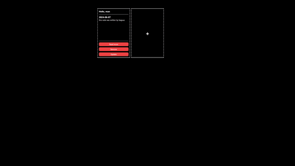

# Notesapp

### Simple desktop note taking app

## Installation

This app is only avaible for Windows at the moment, to install download installer from "releases" section and or download the portable version.

### Usage

Create, retrieve, update, delete notes stored in markdown format that is rendered visually within the app

### License

This software is licensed under GNU GENERAL PUBLIC LICENSE, more about this license can be found [there](https://www.gnu.org/licenses/gpl-3.0.en.html)
